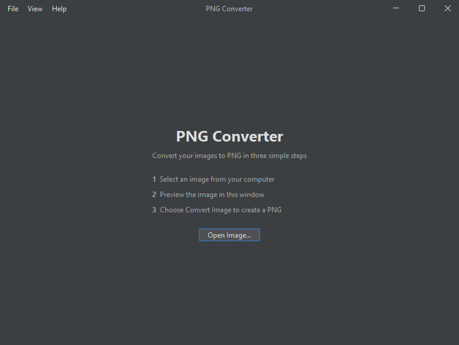

<h1 align="center">PNG Converter</h1>

-----------------

    

This is a very small, lightweight image to png converter made
in Java with Swing. The program utilises FlatLaf for UI themes
and the `SystemFileChooser`, giving access to the OS's native
file dialog instead of using the JFileChooser or JFileDialog
provided by Swing.

The formats supported are:
- `*.jpg`
- `*.jpeg`
- `*.gif`
- `*.bmp`
- `*.webp`

The project also contains the source to the small .exe wrapper I 
wrote (written in C++ with the JNI) under [native](native). 
Both the Java program and the C++ launcher were written in JetBrains 
IDEs (IntelliJ and CLion respectively). 

The wrapper was written specifically for Windows, as it uses the Win32 API, 
and is a compiled Windows Executable, but since the project is Java the source 
can obviously be run from any OS.
